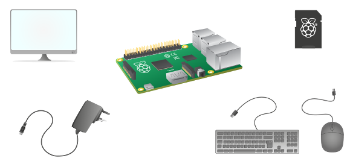
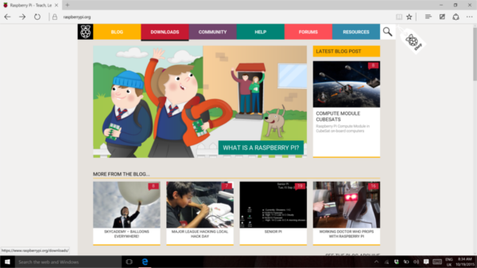
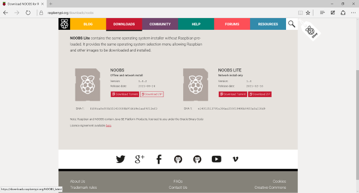
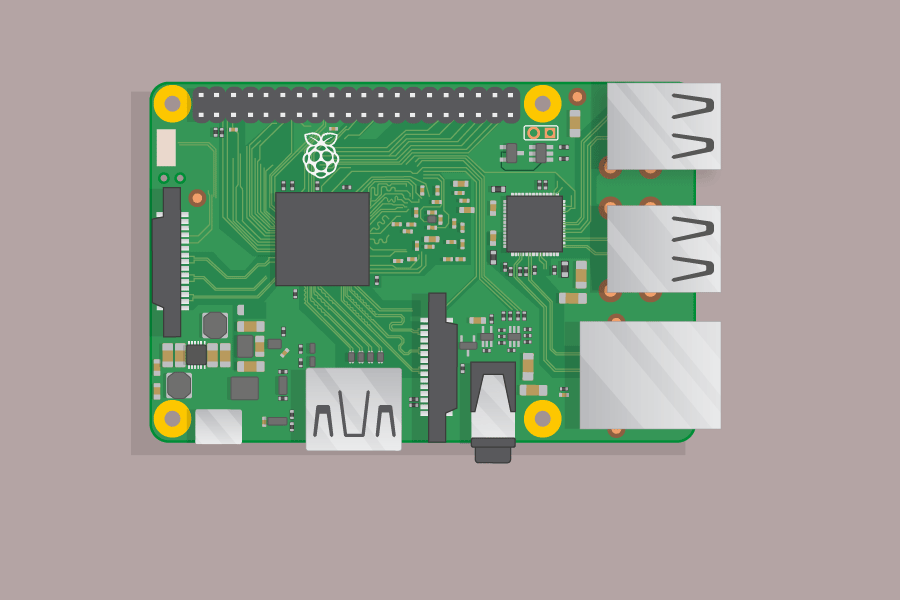

# Guide de démarrage rapide Raspberry Pi

Got a Raspberry Pi? Great: let's get started by making sure you have all the cables and accessories before plugging them all in and logging in for the first time.

## Check you have the equipment you need

Before you plug anything into your Raspberry Pi, make sure that you have all the equipment you have [all the equipment listed here](https://www.raspberrypi.org/learning/quick-start-guide/requirements/).

Pour commencer, il vous faudra également un système d'exploitation (OS). NOOBS est un installateur d'OS hyper facile à utiliser pour Raspberry Pi. Raspbian est l'OS le plus répandu dans le monde Raspberry Pi.

To get started with Raspberry Pi, you also need an operating system. NOOBS (New Out Of Box Software) is an easy operating system install manager for the Raspberry Pi. Raspbian is the most common operating system used with the Raspberry Pi. You can download a Raspbian image to an SD card.

## Solution n°1 : Acheter un carte SD avec NOOBS préinstallé

Le moyen le plus simple est le plus rapide est d'acheter une carte SD où le software est déjà installé. Si vous avez déjà acheté une de ces carte, alors vous pouvez sauter jusqu'à la section 'Brancher for Raspberry Pi' un peu plus bas.

<a rel="nofollow" href="https://www.amazon.fr/gp/product/B01CCM6B1K/ref=as_li_tl?ie=UTF8&camp=1642&creative=6746&creativeASIN=B01CCM6B1K&linkCode=as2&tag=curioschron01-21">Carte SD officielle de 8 Go</a>

## Solution n°2 : Charger vous-même NOOBS ou Raspbian sur une carte SD vierge.

L'autre solution est de télécharger NOOBS ou Raspian gratuitement et de l'installer sur votre carte. Prenez une carte d'au minimum 8 Go. Si vous n'en avez pas, pour moins de 10 euros, nous vous conseillons cette <a rel="nofollow" href="https://www.amazon.fr/gp/product/B013UDL5V6/ref=as_li_tl?ie=UTF8&camp=1642&creative=6746&creativeASIN=B013UDL5V6&linkCode=as2&tag=curioschron01-21">Carte microSDHC SanDisk Ultra 16GB classe 10, avec une vitesse de lecture élevée</a>

## Formatez votre carte SD
Le mieux est de formater votre carte SD sur votre PC ou portable avant d'y copier les fichiers NOOBS ou l'image Raspbian.
Pour ce faire:

1. Visitez le site [SD Association](http://www.sdcard.org/) et téléchargez [SD Formatter 4.0](https://www.sdcard.org/downloads/formatter_4/index.html) pour Windows ou Mac.
1. Suivez les instructions pour installer l'application.
1. Inserez votre carte SD dans votre lecteur de carte ou prenez note de la lettre du lecteur associé, par exemple: `F:/`.
1. Dans SD Formatter, selectionnez la lettre du lecteur de votre carte SD card et formattez la.

  

### Téléchargez les fichiers NOOBS et glissez-déposez dans la carte

1. Toujours sur votre ordinateur, visitez [le site officiel Raspberry](http://www.raspberrypi.org/downloads/).

  

1. Cliquez sur **NOOBS**.

  

1. Cliquez sur le bouton **Download ZIP** sous ‘NOOBS (offline and network install)’, et sélectionnez le dossier de destination.
1. Extrayez les fichiers du zip.
1. Once your SD card has been formatted, drag all the files in the extracted NOOBS folder and drop them onto the SD card drive.
1. The necessary files will then be transferred to your SD card.
1. When this process has finished, safely remove the SD card and insert it into your Raspberry Pi.

<iframe src="https://player.vimeo.com/video/90518800" width="500" height="281" frameborder="0" webkitallowfullscreen mozallowfullscreen allowfullscreen></iframe>

### Download and image Raspbian directly

An alternative to using NOOBS to install Raspbian is to download and install the image directly. This is a faster process, and great if you need to image multiple cards for a workshop or class.

1. Using a computer with an SD card reader, visit the official Raspberry Pi [Downloads page](http://www.raspberrypi.org/downloads/).
1. Click on **Raspbian**.

  

1. Click on the **Download ZIP** button under ‘Raspbian Jessie (full desktop image)’, and select a folder to save it to.
1. Extract the files from the zip.

  

1. Visit [etcher.io](http://www.etcher.io/), and download and install the Etcher SD card image utility.
1. Run Etcher and select the Raspbian image you unzipped on your computer or laptop.
1. Then select the SD card drive. Note that the software may have already selected the right drive.
1. Finally, click **Burn** to transfer Raspbian to the SD card. You will see a progress bar that tells you how much is left to do. Once complete, the utility will automatically eject or unmount the SD card so it is safe to remove it from the computer.

  

## Plugging in your Raspberry Pi

1. Begin by slotting your SD card into the SD card slot on the Raspberry Pi. It will only fit one way.
1. Next, plug in your USB keyboard and mouse into the USB ports on the Raspberry Pi.
1. Make sure that your monitor or TV is turned on, and that you have selected the right input (e.g. HDMI 1, DVI, etc).
1. Connect your HDMI cable from your Raspberry Pi to your monitor or TV.
1. If you intend to connect your Raspberry Pi to the internet, plug an Ethernet cable into the Ethernet port, or connect a WiFi dongle to one of the USB ports. 
1. When you are happy that you have plugged all the cables and SD card in correctly, connect the micro USB power supply. This action will turn on and boot your Raspberry Pi.

  

1. If this is the first time your Raspberry Pi and SD card have been used, then you will have to select an operating system and configure it.

<iframe src="https://player.vimeo.com/video/91631396" width="500" height="281" frameborder="0" webkitallowfullscreen mozallowfullscreen allowfullscreen></iframe>

## The first time you power on

1. Once you have plugged in the power cable to your Raspberry Pi, it will boot; if you are using NOOBS, a window will appear with a list of different operating systems that you can install. We recommend that you use Raspbian: tick the box next to Raspbian and click on **Install**.

  

1. Raspbian will then run through its installation process. Please note that this can take a while.
1. When the install process has completed, the Raspberry Pi configuration menu (`raspi-config`) will load. Here you are able to set the time and date for your region, enable a Raspberry Pi camera board, or even create users. You can exit this menu by using **Tab** on your keyboard to move to **Finish**.
1. If you downloaded Raspbian and imaged it using Etcher rather than using NOOBS, then you will boot directly to the desktop environment of Raspbian and won't need to wait.

## What next?

- Learn how to [update your SD card](update-sd-card.md)
- Connect your Raspberry Pi to [WiFi](wifi.md)
- Install more [applications](install-apps.md)
- Discover how to [back up your SD card](backup.md)
- Get started learning or making with our free [resources](https://www.raspberrypi.org/resources/)
