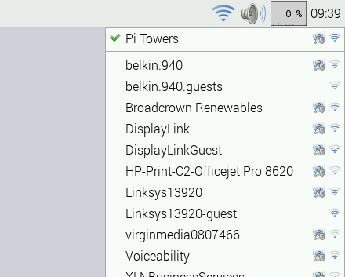

# Guide to connecting to wifi

If you want to connect your Raspberry Pi to the internet or local network then you will need to follow these steps:

## Connecting to wifi
1. Wifi connections can be made via the network icon at the right-hand end of the menu bar. If you are using a Raspberry Pi 3 or there is a wi-fi dongle plugged in on any other model, left-clicking this icon will bring up a list of available wi-fi networks, as shown.
1. If no networks are found, it will show the message `"No APs found - scanning..."` - just wait a few seconds without closing the menu, and it should find your network.
1. The icons on the right show whether a network is secured or not, and its signal strength. Click the network that you want to connect to; if it is secured, a dialog box is shown prompting you to enter the network key.
1. Enter the key and press **OK**, then wait a couple of seconds. The network icon will flash briefly to show that a connection is being made; once it is ready, the icon stops flashing and shows the signal strength.

  

## What next?
- [Return to Quick Start Guide](worksheet.md)
- Learn how to [update your SD Card](update-sd-card.md)
- Install more [applications](install-apps.md)
